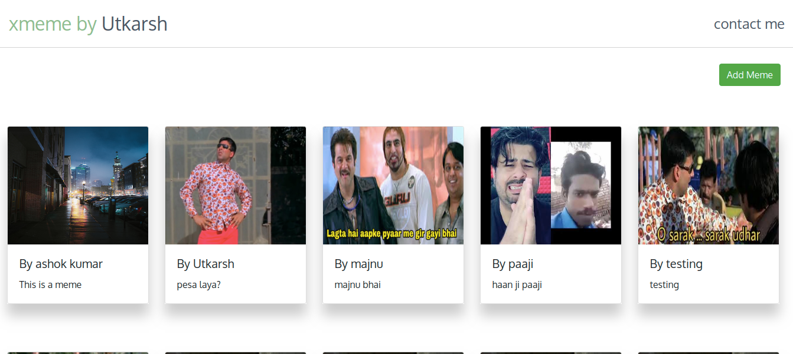

# :zap: XMEME

This is a basic full web stack application made using MEAN stack.

## Deployed Links

- [Frontend](https://memex-frontend.netlify.app/)
- [Backend](https://xmeme-utkarsh.herokuapp.com/memes)

## Url Endpoints

- GET /memes
- POST /memes
- GET /memes/:id

## Implemented

- Deployed HTTPS version in public for both frontend & backend.
- Proper testing of backend using JEST
- Usage of react-bootstrap for image card
- Usage of Flexbox for displaying components
- Code modularity is maintained.
- Proper HTTP status codes are used.

## :memo: To-Do

- [ ] Adding all CRUD operations
- [ ] Swagger documentation of the API
- [ ] Adding Comments in Frontend
- [ ] Dockerizing the application

## Run

- Clone this Repository.
- To run backend locally
  - `cd backend`
  - `npm install`
  - `npm run dev`
- To run frontend locally
  - `cd frontend`
  - `npm install`
  - `npm start`
  - You will see the below home page.

## :camera: Screenshots

    

#### If you have any questions, just let me know [here.](mailto:utkryuk@gmail.com)